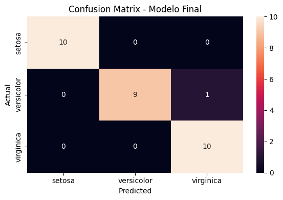
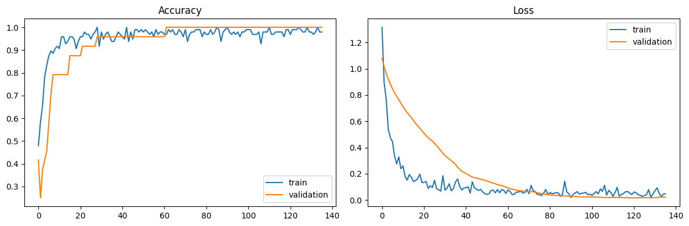
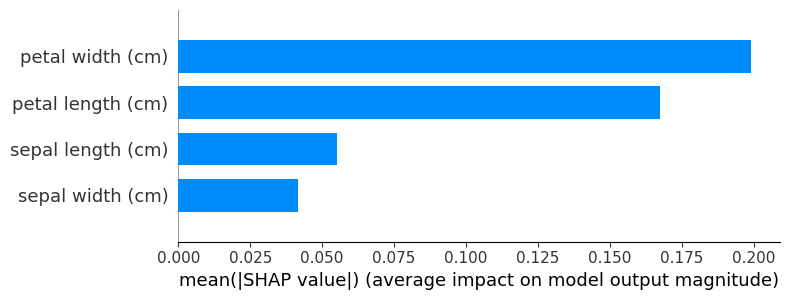

# 🌸 Iris Flower Classifier — Neural Network + MLOps

<div align="center">


</div>

---

# 📌 Project Overview

This project trains a **Neural Network** to classify Iris flowers into three species:

- 🌸 **Setosa**
- 🌼 **Versicolor**
- 🌺 **Virginica**

based on four measurements: sepal length, sepal width, petal length, and petal width.

Beyond just training a model, the project covers a full **MLOps workflow**:

- ✅ Cross-validation for reliable performance estimation
- ✅ Automated hyperparameter tuning with Optuna
- ✅ Model explainability with SHAP
- ✅ Saving and loading the full pipeline
- ✅ Simulated deployment with inference on new data
- ✅ Interactive Streamlit app for live predictions

---

# 🚀 Try It Live

> **[👉 Test the model with your own data](YOUR_STREAMLIT_URL_HERE)**

Enter your own sepal and petal measurements and get an instant prediction with confidence scores.

---

# 🖼️ Project Preview

## 🧠 Neural Network Architecture

```
Input (4 features)
       ↓
Dense(n_units_1)   ← optimized by Optuna
       ↓
BatchNorm + Dropout(rate_1)
       ↓
Dense(n_units_2)   ← optimized by Optuna
       ↓
BatchNorm + Dropout(rate_2)
       ↓
Dense(3) — Softmax
```

## 📊 Confusion Matrix



---

## 📈 Training Curves



---

## 🔍 SHAP Feature Importance



---

# 🧬 Dataset Information

The project uses the classic:

> **Iris Dataset** — 150 samples, 4 features, 3 balanced classes

| Feature | Description |
|---|---|
| Sepal Length | Length of the sepal (cm) |
| Sepal Width | Width of the sepal (cm) |
| Petal Length | Length of the petal (cm) |
| Petal Width | Width of the petal (cm) |

### 🎯 Target Variable

| Value | Species |
|---|---|
| 0 | Setosa |
| 1 | Versicolor |
| 2 | Virginica |

---

# 🛠️ Tech Stack

| Tool | Purpose |
|---|---|
| TensorFlow / Keras | Neural Network model |
| Scikit-learn | Preprocessing & cross-validation |
| SciKeras | Keras ↔ sklearn bridge |
| Optuna | Bayesian hyperparameter tuning |
| SHAP | Model explainability |
| Joblib | Model serialization |
| Streamlit | Interactive web app |
| Pandas / NumPy | Data manipulation |
| Matplotlib / Seaborn | Visualization |

---

# 📂 Project Structure

```bash
Iris-Neural-Network/
│
├── images/
│   ├── confusion_matrix.png
│   ├── training_curves.png
│   └── shap.png
│
├── Proyecto_5.ipynb
├── app.py
├── iris_model.keras
├── iris_scaler.pkl
├── README.md
└── requirements.txt
```

---

# 🚀 Installation

## 1️⃣ Clone the repository

```bash
git clone https://github.com/Ruben221b/iris-neural-network.git
```

## 2️⃣ Navigate into the project

```bash
cd iris-neural-network
```

## 3️⃣ Install dependencies

```bash
pip install -r requirements.txt
```

## 4️⃣ Run the Streamlit app

```bash
streamlit run app.py
```

Or open `Proyecto_5.ipynb` in Jupyter to explore the full workflow.

---

# 🧪 MLOps Workflow

## Part 1 — Cross-Validation

Used `KerasClassifier` (SciKeras) to wrap the Keras model into a sklearn-compatible estimator, enabling **5-Fold Stratified Cross-Validation** directly on the neural network pipeline.

This gives a much more reliable performance estimate than a single train/test split.

## Part 2 — Hyperparameter Tuning with Optuna

Rather than manually choosing layer sizes, dropout rates, and learning rate, **Optuna** searches the space automatically using **Bayesian Optimization** — it learns from each trial to make better choices in the next one.

Parameters tuned:

| Parameter | Search Space |
|---|---|
| `n_units_1` | 16, 32, 64 |
| `n_units_2` | 8, 16, 32 |
| `dropout_1` | 0.1 → 0.4 |
| `dropout_2` | 0.1 → 0.3 |
| `learning_rate` | 1e-4 → 1e-2 (log scale) |

## Part 3 — Explainability with SHAP

Neural networks are black boxes. **SHAP** (SHapley Additive exPlanations) answers:

> *How much did each feature contribute to this specific prediction?*

This is critical in production to audit the model and understand its decisions — not just trust a confidence score.

## Part 4 — Pipeline Serialization & Inference

The trained scaler and model are saved separately:

```python
joblib.dump(scaler, 'iris_scaler.pkl')
final_model.save('iris_model.keras')
```

And loaded for inference on new data — simulating a real deployment scenario.

---

# 📈 Results Summary

| Metric | Result |
|---|---|
| Cross-Validation Accuracy | Very Strong |
| Test Accuracy | Excellent |
| Generalization | Strong |
| Overfitting | Minimal |

---

# 🎯 Final Conclusion

This project goes beyond basic model training by treating the neural network as a **production artifact** — optimized, explainable, serialized, and deployable.

The combination of Optuna's automated search and SHAP's transparency creates a model that is not only accurate but auditable and ready for real-world use.

---

# 🔮 What Comes Next

- 🌐 Serve the model as a REST API with **FastAPI + Docker**
- 📊 Monitor data drift in production with **Evidently**
- 🔄 Automated retraining pipelines

---

# 👨‍💻 Author

## Rubén Cuello

💡 Data Scientist & Full Stack Developer  
🧠 Passionate about Machine Learning, AI & Data Analysis

---

# ⭐ Support

If you found this project interesting:

- ⭐ Star the repository
- 🍴 Fork the project
- 🧠 Share suggestions
- 🚀 Contribute improvements

---

# 📬 Contact

## GitHub

```
https://github.com/Ruben221b
```

## LinkedIn

```
https://www.linkedin.com/in/rubendcuello/
```